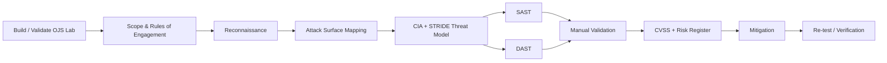

# OJS DevSecOps Security Assessment

A portfolio case study of an **authorized vulnerability assessment of Open Journal Systems (OJS)** performed in a controlled university lab. The project covers lab setup, attack-surface mapping, CIA/STRIDE threat modeling, SAST, DAST, manual validation, CVSS-based risk treatment, mitigation planning, and re-testing.

> **Portfolio note:** this repository is a curated and sanitized presentation of collaborative work originally completed across the `dso-1` organization repositories. It does not claim the entire assessment as solo work. My individual role and verifiable contribution links are documented in [CONTRIBUTIONS.md](./CONTRIBUTIONS.md).

  

The visual above is reconstructed from the repository's documented architecture, assessment workflow, tooling, and verification artifacts. It is **not a fabricated production screenshot** and deliberately omits lab addresses, credentials, and session data.

## Senior technical review path

A reviewer who wants to validate the engineering rather than only read the summary can follow this path:

1. **System boundary:** [docs/ARCHITECTURE.md](./docs/ARCHITECTURE.md) — OJS, Apache/PHP, authentication/session flow, REST API, file handling, database and file-system trust boundaries.
2. **Threat reasoning:** [docs/THREAT_MODEL.md](./docs/THREAT_MODEL.md) — CIA/STRIDE mapping and trust-boundary analysis.
3. **Test design:** [docs/TEST_MATRIX.md](./docs/TEST_MATRIX.md) + [METHODOLOGY.md](./METHODOLOGY.md) — what was tested, how, and with which evidence level.
4. **Executable security artifacts:** [custom Semgrep rules](./artifacts/semgrep/custom_rules.yaml) and [sanitized Jenkins pipeline](./artifacts/ci-cd/Jenkinsfile.example).
5. **Risk treatment:** [FINDINGS.md](./FINDINGS.md) → [RISK_REGISTER.md](./RISK_REGISTER.md) → [MITIGATION.md](./MITIGATION.md).
6. **Verification & provenance:** [VERIFICATION.md](./VERIFICATION.md), [LIMITATIONS.md](./LIMITATIONS.md), [CONTRIBUTIONS.md](./CONTRIBUTIONS.md), and [docs/SOURCE_EVIDENCE.md](./docs/SOURCE_EVIDENCE.md).

## What a reviewer can inspect quickly

| Area | Evidence |
|---|---|
| OJS lab setup | [docs/LAB_SETUP.md](./docs/LAB_SETUP.md) |
| Assessment workflow | [METHODOLOGY.md](./METHODOLOGY.md) |
| Architecture / attack surface | [docs/ARCHITECTURE.md](./docs/ARCHITECTURE.md) |
| CIA + STRIDE threat model | [docs/THREAT_MODEL.md](./docs/THREAT_MODEL.md) |
| Test coverage | [docs/TEST_MATRIX.md](./docs/TEST_MATRIX.md) |
| Consolidated findings | [FINDINGS.md](./FINDINGS.md) |
| CVSS and business-risk treatment | [RISK_REGISTER.md](./RISK_REGISTER.md) |
| Recommended remediation | [MITIGATION.md](./MITIGATION.md) |
| Re-testing approach | [VERIFICATION.md](./VERIFICATION.md) |
| Individual contribution | [CONTRIBUTIONS.md](./CONTRIBUTIONS.md) |
| Source provenance | [docs/SOURCE_EVIDENCE.md](./docs/SOURCE_EVIDENCE.md) |
| Semgrep artifact | [artifacts/semgrep/custom_rules.yaml](./artifacts/semgrep/custom_rules.yaml) |
| CI/CD example | [artifacts/ci-cd/Jenkinsfile.example](./artifacts/ci-cd/Jenkinsfile.example) |

## Assessment lifecycle

## Environment and attack surface

The assessment targeted **OJS 3.3.0-8** in a lab environment using Apache, PHP, and MariaDB/MySQL. Review areas included:

- authentication, password-verification, session and role flows;
- REST API authorization and information exposure;
- article submission, upload and file-management paths;
- administrative and plugin functionality;
- database, file-system, template/output and OS-interaction trust boundaries;
- web-server, cookie and transport-security configuration.

The engagement explicitly avoided destructive activity: no intentional denial of service, destructive modification, or bulk extraction of sensitive data. The work used a grey-box approach and responsible-testing constraints.

## Security tooling and why it was used

| Layer | Tools / technique | Purpose |
|---|---|---|
| Source analysis | Semgrep, custom Semgrep rules, PHP-oriented manual review | Identify dangerous sinks, authorization mistakes and data-flow concerns |
| Web reconnaissance | WhatWeb, Gobuster, Nikto | Inventory exposed behavior and server/application surface |
| Dynamic testing | OWASP ZAP, SQLMap | Probe selected runtime weaknesses in the controlled target |
| Manual validation | Burp Suite, Postman, curl | Reproduce and distinguish real behavior from scanner-only signals |
| Risk analysis | CVSS v3.1 + risk register | Separate technical severity from remediation priority |
| Verification | targeted re-testing | Determine whether mitigations address the tested condition |

Automated scanner output was treated as **input to validation**, not automatically as a confirmed vulnerability.

## Key assessment themes

The project identified recurring risk themes in authentication protection, access control, server hardening, transport security, cookie configuration, information disclosure, and potentially dangerous source-code primitives. The canonical detailed finding IDs in this portfolio are taken from the report's detailed findings section (`VUL-001` through `VUL-015`).

The original team report contains internal inconsistencies between executive-summary counts, detailed CVSS severities, risk-priority tables, and patch-verification numbering. This portfolio does not silently normalize those records. [RISK_REGISTER.md](./RISK_REGISTER.md) separates **technical severity** from **business priority**, while [VERIFICATION.md](./VERIFICATION.md) documents the retained numbering mismatch.

## My role and attribution

I served as **Group Lead (Ketua Kelompok) and Security Engineer (SAST)** within a seven-person team. My technical work focused on OJS lab setup/documentation, source-code analysis, REST API and admin attack-surface review, authentication data-flow analysis, vulnerability documentation, and contributions to SAST/DAST and final reporting artifacts.

Examples of findings attributed to me in the retained final report include:

- `VUL-002` — Information Disclosure / User API Exposure
- `VUL-013` — `phpinfo()` Exposure
- `VUL-014` — Potential Insecure Deserialization
- `VUL-015` — Potential Command Injection (`exec` / `popen`)

The original kickoff matrix separately identifies another teammate as **Project Lead / Scrum Master**. This portfolio therefore uses **Group Lead / Ketua Kelompok** for my coordination role and retains the original source mapping rather than rewriting team history.

Some work was also performed from a shared/other team laptop, so local Git author identity is not treated as the only contribution signal. The attribution model is documented in [CONTRIBUTIONS.md](./CONTRIBUTIONS.md).

## Broader DevSecOps ecosystem

This assessment was one workstream inside a larger collaborative project. Related case studies are intentionally separated so a reviewer can inspect each engineering story independently:

- **Go Reserve DevSecOps Platform** — application/container/CI-CD delivery case study.
- **LLM vs Semgrep SAST Comparison** — security-tooling experiment comparing an LLM analyzer with Semgrep-based detection.

The original organization repositories remain linked in [docs/PROJECT_ECOSYSTEM.md](./docs/PROJECT_ECOSYSTEM.md) and [docs/SOURCE_EVIDENCE.md](./docs/SOURCE_EVIDENCE.md).

## Limitations and production context

This is an **authorized academic security assessment**, not a claim of production penetration-testing coverage. Raw secrets, host addresses, session values and operational credentials are intentionally excluded. Findings marked potential or scanner-derived remain distinct from manually reproduced conditions. See [LIMITATIONS.md](./LIMITATIONS.md) for the complete boundary.

---

**Portfolio owner:** [Syifani Adillah Salsabila](https://github.com/syifaniads)  
**Role:** Group Lead / Security Engineer (SAST)  
**Project type:** Collaborative DevSecOps / Application Security Assessment  
**Context:** Universitas Brawijaya — 2026
