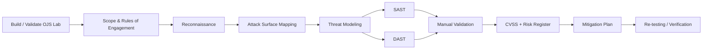

# OJS DevSecOps Security Assessment

A portfolio case study of an **authorized vulnerability assessment of Open Journal Systems (OJS)** performed in a controlled university lab. The project covers the full security-assessment lifecycle: lab setup, scope definition, reconnaissance, attack-surface mapping, threat modeling, SAST, DAST, manual validation, risk scoring, mitigation planning, and re-testing.

> **Portfolio note:** this repository is a curated and sanitized presentation of collaborative work originally completed across the `dso-1` organization repositories. It does not claim the entire assessment as solo work. My individual role and verifiable contribution links are documented in [CONTRIBUTIONS.md](./CONTRIBUTIONS.md).

## What a reviewer can inspect quickly

| Area | Evidence |
|---|---|
| OJS lab setup | [docs/LAB_SETUP.md](./docs/LAB_SETUP.md) |
| Assessment workflow | [METHODOLOGY.md](./METHODOLOGY.md) |
| Architecture / attack surface | [docs/ARCHITECTURE.md](./docs/ARCHITECTURE.md) |
| CIA + STRIDE threat model | [docs/THREAT_MODEL.md](./docs/THREAT_MODEL.md) |
| Test coverage | [docs/TEST_MATRIX.md](./docs/TEST_MATRIX.md) |
| Consolidated findings | [FINDINGS.md](./FINDINGS.md) |
| CVSS and business-risk treatment | [RISK_REGISTER.md](./RISK_REGISTER.md) |
| Recommended remediation | [MITIGATION.md](./MITIGATION.md) |
| Re-testing approach and limitations | [VERIFICATION.md](./VERIFICATION.md) |
| My specific contribution | [CONTRIBUTIONS.md](./CONTRIBUTIONS.md) |
| Original repositories and source evidence | [docs/SOURCE_EVIDENCE.md](./docs/SOURCE_EVIDENCE.md) |
| Complete DevSecOps project ecosystem | [docs/PROJECT_ECOSYSTEM.md](./docs/PROJECT_ECOSYSTEM.md) |
| Original artifact inventory | [docs/ORIGINAL_ARTIFACT_INVENTORY.md](./docs/ORIGINAL_ARTIFACT_INVENTORY.md) |
| Curated Semgrep rule artifact | [artifacts/semgrep/custom_rules.yaml](./artifacts/semgrep/custom_rules.yaml) |
| Sanitized Jenkins deployment example | [artifacts/ci-cd/Jenkinsfile.example](./artifacts/ci-cd/Jenkinsfile.example) |
| Security / disclosure policy | [SECURITY.md](./SECURITY.md) |

## Assessment lifecycle

## Environment and scope

The assessment targeted **OJS 3.3.0-8** in a lab environment using Apache, PHP, and MariaDB/MySQL. Testing focused on public application endpoints, authentication/session behavior, file-upload paths, REST API exposure, web-server configuration, third-party components, and selected source-code paths.

The engagement explicitly avoided destructive activity: no intentional denial of service, no destructive modification, and no full extraction of sensitive data. The work used a grey-box approach and followed responsible-testing constraints.

## Tooling

**SAST / source review**

- Semgrep
- custom Semgrep rules
- PHP_CodeSniffer / security-oriented code review
- manual review of authorization, database, file-management, plugin, and template-rendering paths

**DAST / recon / validation**

- OWASP ZAP
- Nikto
- SQLMap
- Gobuster
- WhatWeb
- Burp Suite / Postman / curl for selected manual checks

**Risk analysis**

- CVSS v3.1
- OWASP-oriented likelihood × impact prioritization
- risk register and mitigation roadmap

## Key assessment themes

The project identified recurring risk themes in authentication protection, access control, server hardening, transport security, cookie configuration, information disclosure, and potentially dangerous source-code primitives. The canonical detailed finding IDs used in this portfolio are taken from the report's detailed findings section (`VUL-001` through `VUL-015`).

A senior reviewer should note that the original team report contains **internal inconsistencies between its executive-summary counts, detailed CVSS severities, risk-priority table, and patch-verification numbering**. This portfolio does not silently rewrite those records. Instead, [RISK_REGISTER.md](./RISK_REGISTER.md) separates **technical severity (CVSS)** from **business priority**, and [VERIFICATION.md](./VERIFICATION.md) explicitly documents the numbering mismatch in the original appendix.

## My role

I served as **Group Lead (Ketua Kelompok) and Security Engineer (SAST)** within a seven-person team.

My leadership responsibilities included coordinating the team's assessment stages, keeping deliverables aligned across meetings, reviewing progress and documentation, and helping consolidate outputs into the final assessment package. My technical work focused on OJS lab setup/documentation, source-code analysis, REST API and admin attack-surface review, authentication data-flow analysis, vulnerability documentation, and contributions to SAST/DAST and final reporting artifacts.

The original kickoff role matrix records my technical role as **Security Engineer (SAST)**. The same matrix separately labels another teammate as **Project Lead / Scrum Master**; this portfolio uses **Ketua Kelompok / Group Lead** to describe my team-coordination responsibility while keeping that original role matrix linked for transparency. See [CONTRIBUTIONS.md](./CONTRIBUTIONS.md) and [docs/SOURCE_EVIDENCE.md](./docs/SOURCE_EVIDENCE.md).

Examples of findings attributed to me in the final report include:

- `VUL-002` — Information Disclosure / User API Exposure
- `VUL-013` — `phpinfo()` Exposure
- `VUL-014` — Potential Insecure Deserialization
- `VUL-015` — Potential Command Injection (`exec` / `popen`)

## Curated technical artifacts

The personal portfolio preserves a few small, non-sensitive examples rather than copying every raw team artifact:

- [`artifacts/semgrep/custom_rules.yaml`](./artifacts/semgrep/custom_rules.yaml) — PHP Semgrep rules used for source review patterns such as `eval`, `unserialize`, and dynamic include/require usage.
- [`artifacts/ci-cd/Jenkinsfile.example`](./artifacts/ci-cd/Jenkinsfile.example) — sanitized version of the team's Jenkins build, image-transfer, remote deployment, database setup, and verification workflow.

## Broader DevSecOps project ecosystem

The five OJS assessment repositories are only one part of the group's wider DevSecOps work. The same organization also contains:

- [`dso-1/project`](https://github.com/dso-1/project) — Jenkins/Docker deployment engineering, application code, and multi-project CI/CD architecture material;
- [`dso-1/kelompok1_website`](https://github.com/dso-1/kelompok1_website) — **Go Reserve**, a room-reservation system built with TanStack Start, TypeScript, Prisma, and PostgreSQL;
- [`dso-1/sast-llm`](https://github.com/dso-1/sast-llm) — a hands-on comparison of LLM-based SAST and Semgrep, including vulnerable samples, analysis tooling, and result comparison.

The relationship between these workstreams is documented in [docs/PROJECT_ECOSYSTEM.md](./docs/PROJECT_ECOSYSTEM.md).

## Commit-attribution caveat

Some of my project work was performed from a **shared / other team laptop**. In those cases, the local Git author identity can reflect the laptop's Git configuration rather than the person who actually performed the work. As a result, filtering GitHub history only by `author:syifaniads` can undercount my contribution.

This portfolio therefore uses multiple evidence types: direct commits under my account, assigned issues, report-level attribution, artifact ownership, and team-level project history. I do **not** reassign a specific commit recorded under another person's identity to myself unless there is an independent basis for doing so. The evidence model is documented in [docs/SOURCE_EVIDENCE.md](./docs/SOURCE_EVIDENCE.md).

## Repository design

This repository intentionally **does not mirror the entire OJS codebase, every raw scan artifact, or unrelated group application source**. It is structured as an engineering portfolio: concise findings, methodology, evidence links, sanitized examples, and explicit attribution. Raw team artifacts remain referenced in the original organization repositories where contribution history is preserved.

## Ethical and security note

All testing described here was performed against an authorized lab target. Host addresses, credentials, session values, and other operational secrets are intentionally omitted from this portfolio. Do not use the techniques documented here against systems without explicit authorization.

## Original collaborative work

The core assessment was completed across five repositories covering kickoff/scope, attack-surface mapping, SAST/DAST, risk scoring, and final reporting. The broader organization also contains separate application, CI/CD, and security-tooling workstreams. Links, contribution proof, repository boundaries, and attribution caveats are collected in [docs/SOURCE_EVIDENCE.md](./docs/SOURCE_EVIDENCE.md), [docs/PROJECT_ECOSYSTEM.md](./docs/PROJECT_ECOSYSTEM.md), and [docs/ORIGINAL_ARTIFACT_INVENTORY.md](./docs/ORIGINAL_ARTIFACT_INVENTORY.md).

---

**Portfolio owner:** [Syifani Adillah Salsabila](https://github.com/syifaniads)  
**Role:** Group Lead / Security Engineer (SAST)  
**Project type:** Collaborative DevSecOps / Application Security Assessment  
**Context:** Universitas Brawijaya — 2026
