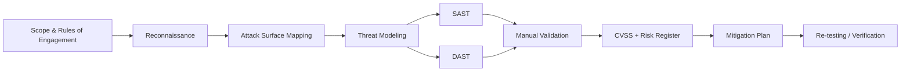

# OJS DevSecOps Security Assessment

A portfolio case study of an **authorized vulnerability assessment of Open Journal Systems (OJS)** performed in a controlled university lab. The project covers the full security-assessment lifecycle: scope definition, reconnaissance, attack-surface mapping, threat modeling, SAST, DAST, manual validation, risk scoring, mitigation planning, and re-testing.

> **Portfolio note:** this repository is a curated and sanitized presentation of collaborative work originally completed across the `dso-1` organization repositories. It does not claim the entire assessment as solo work. My individual role and verifiable contribution links are documented in [CONTRIBUTIONS.md](./CONTRIBUTIONS.md).

## What a reviewer can inspect quickly

| Area | Evidence |
|---|---|
| 60-second recruiter summary | [PORTFOLIO.md](./PORTFOLIO.md) |
| Assessment workflow | [METHODOLOGY.md](./METHODOLOGY.md) |
| Consolidated findings | [FINDINGS.md](./FINDINGS.md) |
| CVSS and business-risk treatment | [RISK_REGISTER.md](./RISK_REGISTER.md) |
| Recommended remediation | [MITIGATION.md](./MITIGATION.md) |
| Re-testing approach | [VERIFICATION.md](./VERIFICATION.md) |
| Architecture / attack surface | [docs/ARCHITECTURE.md](./docs/ARCHITECTURE.md) |
| CIA + STRIDE threat model | [docs/THREAT_MODEL.md](./docs/THREAT_MODEL.md) |
| Positive + negative test coverage | [docs/TEST_MATRIX.md](./docs/TEST_MATRIX.md) |
| My specific contribution | [CONTRIBUTIONS.md](./CONTRIBUTIONS.md) |
| Original team repositories and commit proof | [docs/SOURCE_EVIDENCE.md](./docs/SOURCE_EVIDENCE.md) |
| Assessment limitations | [LIMITATIONS.md](./LIMITATIONS.md) |
| Security / disclosure policy | [SECURITY.md](./SECURITY.md) |

## Assessment lifecycle

## Environment and scope

The assessment targeted **OJS 3.3.0-8** in a lab environment using Apache, PHP, and MariaDB/MySQL. Testing focused on public application endpoints, authentication/session behavior, file-upload paths, REST API exposure, web-server configuration, third-party components, and selected source-code paths.

The engagement explicitly avoided destructive activity: no intentional denial of service, no destructive modification, and no full extraction of sensitive data. The work used a grey-box approach and followed responsible-testing constraints.

## Tooling

**SAST / source review**

- Semgrep
- PHP_CodeSniffer / security-oriented code review
- Manual review of authorization, database, file-management, plugin, and template-rendering paths

**DAST / recon / validation**

- OWASP ZAP
- Nikto
- SQLMap
- Gobuster
- WhatWeb
- Nmap
- Burp Suite / Postman / curl for selected manual checks

**Risk analysis**

- CVSS v3.1
- OWASP-oriented likelihood × impact prioritization
- Risk register and mitigation roadmap

## Key assessment themes

The project identified recurring risk themes in authentication protection, access control, server hardening, transport security, cookie configuration, information disclosure, and potentially dangerous source-code primitives. The canonical detailed finding IDs used in this portfolio are taken from the report's detailed findings section (`VUL-001` through `VUL-015`).

A senior reviewer should note that the original team report contains **internal inconsistencies between its executive-summary counts, detailed CVSS severities, risk-priority table, and patch-verification numbering**. This portfolio does not silently rewrite those records. Instead, [RISK_REGISTER.md](./RISK_REGISTER.md) separates **technical severity (CVSS)** from **business priority**, and [VERIFICATION.md](./VERIFICATION.md) explicitly documents the numbering mismatch in the original appendix.

## My role

I worked as a **Security Engineer (SAST)** within a seven-person team. My documented work includes source-code analysis, REST API and admin attack-surface review, authentication data-flow analysis, vulnerability documentation, and contributions to SAST/DAST and final reporting artifacts.

Examples of findings attributed to me in the final report include:

- `VUL-002` — Information Disclosure / User API Exposure
- `VUL-013` — `phpinfo()` Exposure
- `VUL-014` — Potential Insecure Deserialization
- `VUL-015` — Potential Command Injection

See [CONTRIBUTIONS.md](./CONTRIBUTIONS.md) for issue and commit evidence.

## Repository design

This repository intentionally **does not mirror the entire OJS codebase or every raw scan artifact**. It is structured as an engineering portfolio: concise findings, methodology, evidence links, sanitized summaries, explicit attribution, and transparent limitations. Raw team artifacts remain referenced in the original organization repositories where contribution history is preserved.

## Ethical and security note

All testing described here was performed against an authorized lab target. Host addresses, credentials, session values, and other operational secrets are intentionally omitted from this portfolio. Do not use the techniques documented here against systems without explicit authorization.

## Original collaborative work

The assessment was completed across five team repositories covering kickoff/scope, attack-surface mapping, SAST/DAST, risk scoring, and final reporting. Links and contribution proof are collected in [docs/SOURCE_EVIDENCE.md](./docs/SOURCE_EVIDENCE.md).

---

**Portfolio owner:** [Syifani Adillah Salsabila](https://github.com/syifaniads)  
**Project type:** Collaborative DevSecOps / Application Security Assessment  
**Context:** Universitas Brawijaya — 2026
