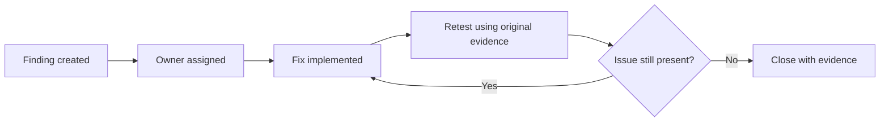

# Verification and Re-testing

The final team report includes a patch-verification phase performed in a lab environment. The stated approach was to repeat relevant tests using the same or comparable methods used during discovery.

## Verification methods described in the report

The report groups verification into three activities:

1. **Automated re-testing** — repeat scanning with tools such as OWASP ZAP and Nikto and compare the results.
2. **Exploit / behavior re-testing** — repeat the original test condition and confirm that the previously observed behavior no longer succeeds.
3. **Configuration validation** — inspect security headers, cookie attributes, endpoint exposure, and related server/application settings.

The report also references SQLMap and manual testing as part of the verification toolset.

## Examples of reported verification outcomes

The final report records examples such as:

- security headers present after configuration changes;
- `HttpOnly` enabled on the relevant cookie;
- CSP enabled;
- directory access returning a forbidden response after hardening;
- detailed error output no longer being shown;
- selected endpoints no longer being accessible in the previously observed way;
- updated runtime/library conditions in the lab environment.

These outcomes should be understood as **team-reported lab verification**, not as an independent external audit.

## Important ID-mapping limitation

The patch-verification table in the final report does **not consistently reuse the same `VUL-xxx` identifiers and names from the detailed findings section**.

For example, the detailed findings section uses `VUL-002` for **User API Exposure**, while the patch-verification section later labels `VUL-002` as **SQL Injection**. Similar mismatches appear for several other rows.

Because of this, this portfolio does not claim a one-to-one verified remediation status for every canonical `VUL-001`–`VUL-015` finding.

Instead, the evidence is represented conservatively:

- the detailed findings section defines the canonical finding IDs;
- the verification appendix demonstrates that re-testing activities were performed;
- where the original ID mapping is ambiguous, the portfolio does not invent a mapping.

## How I would improve verification tracking

A production-ready workflow would use a stable lifecycle per finding:

Each retest record should contain:

- canonical finding ID;
- original evidence reference;
- remediation commit/configuration reference;
- exact retest method;
- expected secure behavior;
- actual result;
- date and tester;
- sanitized evidence artifact;
- final status such as `Open`, `Mitigated`, `Accepted`, or `Not Reproducible`.

## Portfolio status labels

This repository therefore avoids labeling every original issue as definitively fixed. Where the source report provides only generalized or inconsistently numbered verification evidence, the status is best interpreted as:

**`Team-reported re-testing performed; per-finding mapping partially limited by source documentation.`**

That wording is more defensible for a technical interview than overstating remediation certainty.
