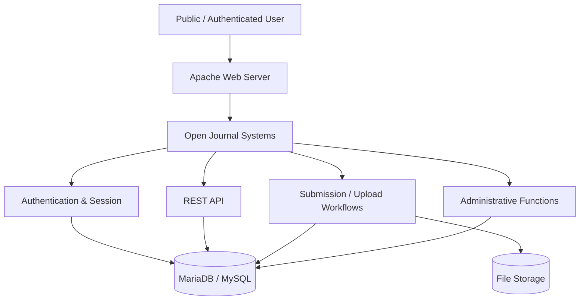
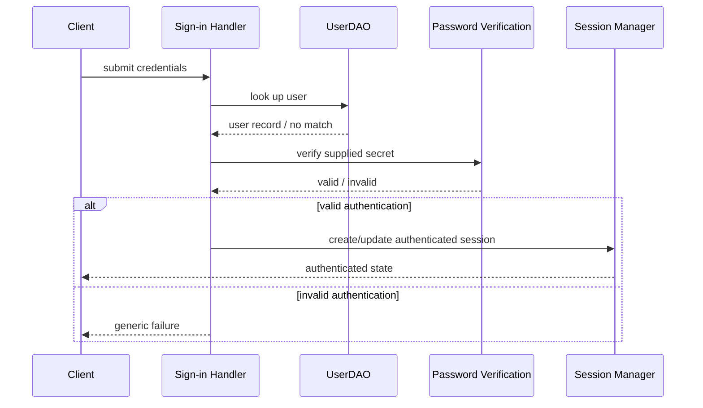
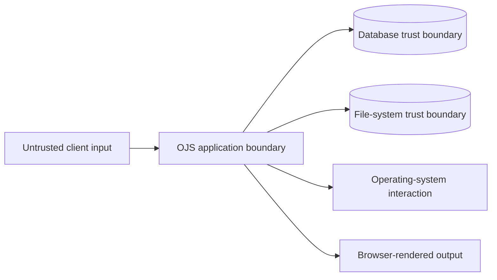

# Architecture and Attack Surface

This page provides a recruiter-friendly view of the system areas reviewed during the assessment. It is intentionally higher level than the raw team diagrams and excludes internal addressing.

## Application context

## Major attack-surface groups

The project mapped entry points into practical groups:

| Group | Examples of reviewed functionality | Security questions |
|---|---|---|
| Authentication & session | login, sign-in processing, password reset, registration | brute-force resistance, account enumeration, session handling, authentication bypass |
| File handling | article submission, API submission flow, admin media/settings, plugin management | file validation, upload restrictions, execution risk, authorization |
| User-controlled content | search, issue metadata, article metadata, user profile | output encoding, stored/reflected XSS, sanitization |
| REST API | users, submissions, contexts | authentication, authorization, information disclosure, IDOR |
| Admin functions | dashboard, plugins, site settings, users/roles | privilege enforcement, RBAC, unsafe administrative functionality |

## Authentication data flow reviewed during the project

The assigned SAST task for the attack-surface phase explicitly called for tracing the authentication path from sign-in through user lookup, password verification, and session creation.

From a security-review perspective, this flow creates several checkpoints:

- input handling before database access;
- safe query construction and parameter binding;
- password-verification behavior;
- response consistency for invalid users;
- session identifier lifecycle;
- privilege/role assignment after authentication;
- rate limiting and monitoring around repeated attempts.

## Trust boundaries

A simplified trust model is:

The SAST review was especially concerned with places where untrusted or insufficiently validated data could cross from the application into:

- database queries;
- object deserialization;
- file operations;
- operating-system command execution;
- HTML / template output.

## Secure results are part of the architecture review

The assessment also documented controls that behaved correctly in selected tests, including role-based access restrictions on admin functionality, denied access to some protected API resources, and encoded/sanitized output in several XSS test cases.

That distinction is useful in architecture review: the goal is not only to find broken paths, but also to understand where trust boundaries are already enforced correctly.

## Original team diagrams

The original attack-surface repository contains the team-generated attack-surface and DFD artifacts:

https://github.com/dso-1/Pertemuan-2-Pemetaan-Attack-Surface-OJS

Those original files remain the source evidence; the diagrams above are sanitized portfolio summaries.
