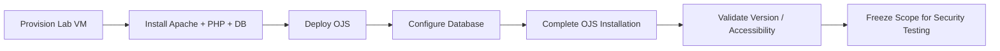

# OJS Lab Setup

## Purpose

Before the vulnerability-assessment workflow could begin, the team needed a controlled OJS environment that could be installed, accessed, documented, and tested safely.

The original kickoff repository includes an **`[INIT] OJS Init`** issue assigned to `syifaniads`, and my commit history includes OJS setup/documentation work. The raw historical repository also contains lab-specific credentials and infrastructure values, so this portfolio intentionally keeps only a sanitized description of the setup.

## Environment

The assessment environment used:

- **Open Journal Systems (OJS):** 3.3.0-8
- **Web server:** Apache
- **Application runtime:** PHP
- **Database:** MariaDB / MySQL
- **Deployment context:** controlled university lab / VM

## Setup responsibilities represented in this portfolio

My contribution to the kickoff stage included work around:

- initializing and validating the OJS lab instance;
- documenting the installation state and version evidence;
- contributing scope / setup documentation;
- preparing the environment so later attack-surface, SAST, and DAST activities could be performed against a known target.

## Why the raw setup is not copied

The original repository history contains values such as:

- administrator credentials;
- database credentials;
- lab IP addresses;
- local filesystem paths.

Those values are **not reproduced here**, even when they were originally committed to the team repository. A professional portfolio should preserve evidence of work without republishing secrets or environment-specific access details.

## Sanitized deployment flow

## Handoff into the assessment lifecycle

Once the target was operational, the project moved into:

1. Rules of Engagement and scope confirmation;
2. attack-surface mapping;
3. CIA / STRIDE threat modeling;
4. SAST and DAST;
5. manual validation;
6. CVSS and business-risk analysis;
7. mitigation planning and re-testing.

## Source evidence

- Original kickoff repository: https://github.com/dso-1/Pertemuan-1-Kickoff-Case-1-Vulnerability-OJS
- Assigned setup issue: https://github.com/dso-1/Pertemuan-1-Kickoff-Case-1-Vulnerability-OJS/issues/8
- Setup/documentation commit evidence is linked from [`CONTRIBUTIONS.md`](../CONTRIBUTIONS.md).
