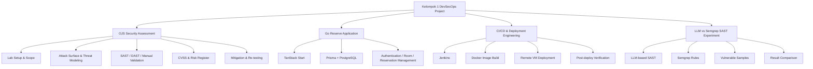

# DevSecOps Project Ecosystem

This portfolio repository focuses on the **OJS security-assessment workstream**, but the original `dso-1` organization contains a broader set of group deliverables. The wider project is now represented by three separate personal portfolio case studies so reviewers can understand the complete engineering context without mixing unrelated source trees into one repository.

## High-level view

## 1. OJS security assessment

**Personal portfolio:** https://github.com/syifaniads/ojs-devsecops-security-assessment

Original repositories:

1. `dso-1/Pertemuan-1-Kickoff-Case-1-Vulnerability-OJS`
2. `dso-1/Pertemuan-2-Pemetaan-Attack-Surface-OJS`
3. `dso-1/Pertemuan-3-Scanning-OJS-SAST-DAST-NEW`
4. `dso-1/Pertemuan-4-Analisis-OWASP-Risk-Scoring`
5. `dso-1/Pertemuan-5-Finalisasi-Laporan-Rekomendasi-Mitigasi`

The workstream covers authorized lab setup, scope and rules of engagement, asset classification, attack-surface mapping, STRIDE threat modeling, SAST, DAST, manual validation, CVSS analysis, business-risk prioritization, mitigation planning, and re-testing.

## 2. Go Reserve application + deployment

**Personal portfolio:** https://github.com/syifaniads/go-reserve-devsecops-platform

Original sources:

- https://github.com/dso-1/kelompok1_website
- https://github.com/dso-1/project (`app-web/` plus Jenkins/CI/CD material)

Go Reserve is a collaborative room-reservation system built with TanStack Start, React/TypeScript, Prisma and PostgreSQL. The product scope includes authentication, role-specific dashboards, room management, reservation workflows, user administration, and server-side reservation conflict validation.

The related delivery workflow uses Jenkins and Docker to build an application image, transfer it to a remote VM, replace the running container, run Prisma database setup, and verify the deployed service.

The personal portfolio mirror preserves representative source, the Prisma data model, authentication/reservation/dashboard services, Docker setup, a sanitized Jenkins pipeline, architecture documentation, and explicit team attribution.

A directly attributable commit from `syifaniads` in the broader project adds the multi-project CI/CD architecture presentation:

- https://github.com/dso-1/project/commit/961df611d3c6fa2b708e93c054148c19379d5098

## 3. LLM vs Semgrep SAST experiment

**Personal portfolio:** https://github.com/syifaniads/llm-semgrep-sast-comparison

Original source:

- https://github.com/dso-1/sast-llm

This collaborative security-tooling project compares LLM-assisted static analysis with Semgrep. It includes intentionally vulnerable Python/JavaScript samples, an LLM-based analyzer, custom Semgrep rules, normalized output, comparison/report logic and an orchestration script.

The personal mirror separates this work from the Go Reserve application even though later history in the organization repository also contains application material. That keeps the recruiter story focused on SAST design, trade-offs, false-positive/false-negative reasoning, determinism, explainability, cost and CI/CD suitability.

## Portfolio separation

| Workstream | Personal repository | Primary story |
|---|---|---|
| OJS assessment | `syifaniads/ojs-devsecops-security-assessment` | AppSec / DevSecOps assessment |
| Go Reserve + CI/CD | `syifaniads/go-reserve-devsecops-platform` | Full-stack + deployment engineering |
| LLM vs Semgrep | `syifaniads/llm-semgrep-sast-comparison` | Security tooling / AI-assisted SAST |

## Attribution note

These are collaborative team outputs, not solo projects. Some work was performed from shared or other team laptops, so historical Git author identity does not always map cleanly to the person who performed the work. GitHub author filters therefore should not be treated as the only measure of contribution.

The portfolio uses multiple evidence types:

1. **directly attributable evidence** — commits/issues linked to `syifaniads`;
2. **task/artifact evidence** — work substantiated by issue assignment, report attribution, deliverable ownership or team records;
3. **team-level output** — applications, pipelines and tools produced collaboratively;
4. **shared-device context** — acknowledgment that local Git identity can differ from the actual person using the device.

No specific commit under another person's identity is reassigned to the portfolio owner without independent support. The personal mirrors instead present the relevant work as collaborative project experience and link to original organization history for transparency.