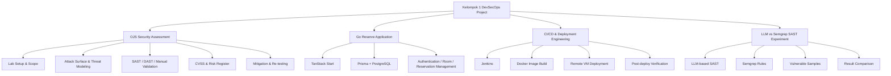
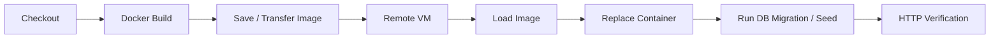

# DevSecOps Project Ecosystem

This portfolio repository focuses on the **OJS security-assessment workstream**, but the original `dso-1` organization contains a broader set of group deliverables. This document records that wider project boundary so a reviewer can understand the complete engineering context without mixing unrelated source trees into one repository.

## High-level view

## 1. OJS security assessment

**Primary portfolio case study:** this repository.

Original repositories:

1. `dso-1/Pertemuan-1-Kickoff-Case-1-Vulnerability-OJS`
2. `dso-1/Pertemuan-2-Pemetaan-Attack-Surface-OJS`
3. `dso-1/Pertemuan-3-Scanning-OJS-SAST-DAST-NEW`
4. `dso-1/Pertemuan-4-Analisis-OWASP-Risk-Scoring`
5. `dso-1/Pertemuan-5-Finalisasi-Laporan-Rekomendasi-Mitigasi`

The workstream covers the full assessment lifecycle: authorized lab setup, scope and rules of engagement, asset classification, attack-surface mapping, STRIDE threat modeling, SAST, DAST, manual validation, CVSS analysis, business-risk prioritization, mitigation planning, and re-testing.

See the repository root documents for the curated version of this work.

## 2. Go Reserve application

Original source:

- https://github.com/dso-1/kelompok1_website
- a later copy/integration also exists under `dso-1/project/app-web`

The original README describes **Go Reserve** as a room-reservation system built with:

- TanStack Start
- TypeScript
- Prisma ORM
- PostgreSQL
- TanStack Query
- Tailwind CSS / Shadcn UI
- Vitest / React Testing Library
- Biome and Husky

Feature scope includes authentication, role-specific dashboards, room management, reservations, user administration, and public-facing pages.

This repository does **not** duplicate the full Go Reserve source because it is a distinct application and group-authored codebase. It is linked here to preserve the complete DevSecOps project story.

## 3. CI/CD and deployment engineering

Original source:

- https://github.com/dso-1/project

The repository contains a Jenkins pipeline, Dockerized application components, deployment material, and a multi-project CI/CD architecture presentation.

The Jenkins pipeline demonstrates the following deployment sequence:

A sanitized example of the pipeline is preserved at [`../artifacts/ci-cd/Jenkinsfile.example`](../artifacts/ci-cd/Jenkinsfile.example).

A directly attributable commit from `syifaniads` in this repository adds the multi-project CI/CD architecture presentation:

- https://github.com/dso-1/project/commit/961df611d3c6fa2b708e93c054148c19379d5098

## 4. LLM vs Semgrep SAST experiment

Original source:

- https://github.com/dso-1/sast-llm

The repository implements a hands-on comparison between an LLM-based SAST analyzer and Semgrep. The project contains:

- intentionally vulnerable Python and JavaScript samples;
- an LLM-based analyzer;
- prompt templates;
- Semgrep rules and runner scripts;
- comparison logic and HTML reporting;
- an orchestration script to run both approaches.

The experiment compares characteristics such as speed, cost, reproducibility, contextual reasoning, false positives, CI/CD suitability, and remediation quality.

This is relevant to the portfolio because it extends the project from **using SAST tools** into **understanding and comparing how SAST approaches work**.

## Repository boundary

The portfolio deliberately separates three things:

| Category | Treatment in this repository |
|---|---|
| OJS assessment artifacts | curated and documented in depth |
| Small non-sensitive technical artifacts | selectively preserved as examples |
| Full group application/tooling source | linked to original repository rather than duplicated wholesale |

This boundary keeps the portfolio readable for recruiters while preserving traceability to the original organization.

## Attribution note

Some project work was performed from shared or other team laptops, so the historical Git author identity does not always map cleanly to the person who performed the work. GitHub author filters therefore should **not** be treated as the only measure of contribution.

For this reason, this portfolio distinguishes between:

1. **directly attributable evidence** — commits/issues linked to `syifaniads`;
2. **task/artifact evidence** — work substantiated by issue assignment, report attribution, or deliverable ownership;
3. **team-level outputs** — repositories and artifacts produced collaboratively;
4. **shared-device history** — commits whose local Git identity may reflect the laptop configuration rather than the actual contributor.

No specific commit under another person's identity is reassigned to the portfolio owner without an independent basis for doing so.
