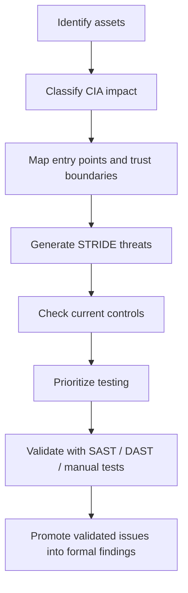

# Threat Model

The attack-surface phase included both **CIA-based asset classification** and a **STRIDE threat model**. This page is a sanitized portfolio summary of those team artifacts.

## Critical assets considered

The working CIA inventory covered 18 assets. Examples included:

| Asset area | Confidentiality | Integrity | Availability | Working criticality |
|---|---:|---:|---:|---|
| Privileged authentication data | High | High | Medium | Critical |
| Unpublished manuscripts | High | High | Medium | Critical |
| Application configuration / database secrets | High | High | Medium/Low | Critical |
| Session material | High | High | Medium | Critical |
| Upload / file-storage paths | High | High | High | Critical |
| Plugin / administration functions | High | High | High | Critical |
| User API data | High | Medium | Medium | High |
| Published article data | Low | High | High | High |
| Reviewer data | Medium | High | Medium | High |
| Server logs / exposed service metadata | Medium | Medium/Low | Medium/Low | Medium |

The value of the CIA exercise was to prioritize **what matters if a control fails**, rather than treating every endpoint as equally important.

## STRIDE coverage

The team threat model considered all six STRIDE categories:

| STRIDE category | Representative concerns reviewed |
|---|---|
| **Spoofing** | repeated-login abuse, credential misuse, session theft, password-reset abuse, automated registration |
| **Tampering** | unsafe upload paths, injection hypotheses, metadata manipulation, administrative configuration changes |
| **Repudiation** | weak audit trails, post-compromise log integrity, ownership / metadata changes |
| **Information Disclosure** | user API exposure, server/version fingerprinting, directory enumeration, configuration exposure |
| **Denial of Service** | login/reset/registration flooding, storage exhaustion, request-volume concerns |
| **Elevation of Privilege** | privileged account compromise, unsafe file execution hypotheses, admin-route access, IDOR, role manipulation |

## Threat-model workflow

## Why threat-model severity differs from the final finding list

The STRIDE matrix was a **working threat-model artifact**, not the final vulnerability register. It contains hypotheses, conditional risks, secure results, and potential attack paths. Some items marked as high-impact threats were not reproduced, were conditional on a feature being enabled, or were not promoted into the final `VUL-001`–`VUL-015` list.

That distinction is intentional in this portfolio:

- **Threat model** = what could go wrong and what should be tested.
- **Test matrix** = what was actually exercised and what behavior was observed.
- **Final findings** = the canonical issues selected for the final assessment report.

See [TEST_MATRIX.md](./TEST_MATRIX.md) and [../FINDINGS.md](../FINDINGS.md).

## Example of control validation

The working threat model included both risky and secure observations. Selected admin and API routes were tested for unauthorized access, some XSS hypotheses did not execute because output was encoded/sanitized, and selected SQL-injection hypotheses did not reproduce. Conversely, user-data exposure and several hardening gaps were promoted into the final assessment.

Recording secure outcomes alongside risks is important because it reduces false positives and provides evidence about existing controls.

## Source evidence

The original team files are available in the attack-surface repository:

- CIA asset table:  
  https://github.com/dso-1/Pertemuan-2-Pemetaan-Attack-Surface-OJS/blob/main/4_Tabel%20aset%20kritis%20CIA.md
- STRIDE matrix:  
  https://github.com/dso-1/Pertemuan-2-Pemetaan-Attack-Surface-OJS/blob/main/5_Threat%20model%20matrix%20STRIDE.md

The originals include lab-specific values and exploratory details that are intentionally not duplicated here.
